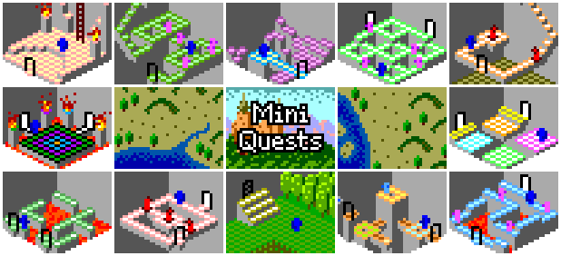

# Mini Quests
Explore dungeons, solve puzzles, fight monsters, be a hero!

Mini Quests is an epic isometric adventure brought to life in 40-by-30 pixels and 16 colours.

Play in browser or download for Windows/OSX/Linux:
[itch.io](https://dishmoth.itch.io/mini-quests)

Play on Android:
[Google Play](https://play.google.com/store/apps/details?id=com.dishmoth.miniquests),
[Amazon Appstore](https://www.amazon.com/dp/B07859CKY9)

Homepage:
[dishmoth.com](http://dishmoth.com/games/mini-quests/)

### Setting up
The game is built with [libGDX](https://libgdx.badlogicgames.com/).
Set up your development environment following the
[libGDX instructions](https://github.com/libgdx/libgdx/wiki).
Clone or download the repository, and import it into your development environment to build
and run.

### Platforms
LibGDX allows the project to be built for assorted targets: Windows, OSX, Linux, Android, HTML, and iOS (although that's not been tried yet).

Although the project currently relies on libGDX, the game can also be run without it as a pure Java application. Sound is disabled by default in this mode (it can be enabled by including the [JOrbis](http://www.jcraft.com/jorbis/) library and uncommenting some code in `OggDecode.java`) and game saving and loading is not supported at present.

### Project layout
The project follows the usual libGDX layout, with a main folder for the source code, and different folders to support building for different targets. 
- `core` -  the main source code, common to all targets 
- `desktop` - specifics for desktop targets (Windows, OSX, Linux)
- `android` - specifics for Android
- `assets` - image and audio assets, common to all targets
- `html` - specifics for HTML
- `ios` - specifics for iOS (untested)
- `app` - specifics for pure Java (only partially supported)
